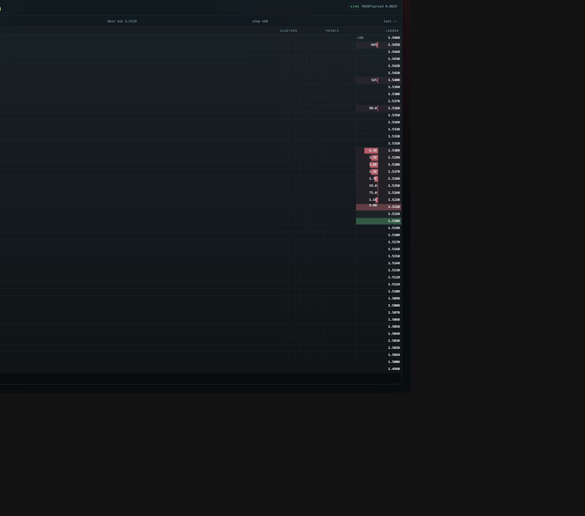
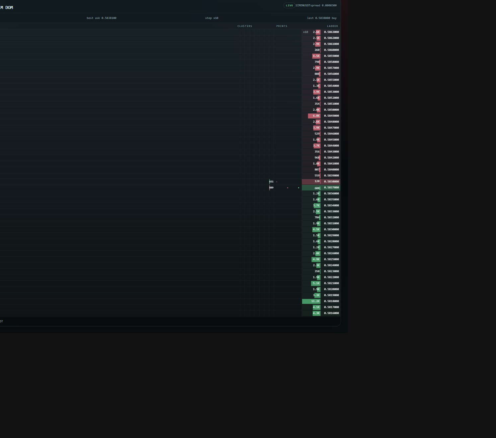

# Stakan

Public web version of a compact trading `DOM / ladder / stakan` in the same class of interface people know from MetaScalp and TigerTrade.

Use it, fork it, embed it in your own screener or dashboard if you want.

Current version:
- `0.4.0`

## What It Is

This project renders a dense operator-style ladder for the browser:
- `clusters | prints | ladder`
- asks above, bids below, spread in between
- adjustable compression
- minute clusters
- batched prints with circle/capsule rendering
- compact right-aligned layout so several ladders can fit on one screen

It is built as an embeddable widget, not as a standalone terminal only.

## Supported Exchanges

- `Binance USD-M Futures`
- `ApeX Omni`

Test symbols:
- Binance: `SIRENUSDT`
- ApeX Omni: `M` -> resolves to `MUSDT`

## Screenshots

### ApeX Omni



### Binance USDT-M



## Features

- Canvas-rendered body for dense updates
- Sticky viewport so price moves across the ladder instead of recentring every tick
- Side tint across both ladder columns: `size + price`
- Full-row `best bid / best ask` highlight
- Fixed fill scales:
  - ladder: `10k = full`
  - clusters: `40k = full`
- Prints aggregated by `200ms`
- Small prints `< 1k` as dots
- Larger prints as circles or stretched capsules when one burst spans several prices
- React component export
- Web component export

## Quick Start

```bash
npm install
npm run dev
```

## Build

```bash
npm run build
```

## Embedding

React:

```tsx
import { DomLadderWidget } from "stakan-dom-widget";

export function Screen() {
  return <DomLadderWidget exchange="apex-omni" symbol="M" compression={10} />;
}
```

Web component:

```ts
import { defineStakanDomElement } from "stakan-dom-widget";

defineStakanDomElement();
```

```html
<stakan-dom-ladder exchange="apex-omni" symbol="M" compression="10"></stakan-dom-ladder>
```

## Scope

This is currently public market data only.

Implemented:
- Binance USD-M adapter
- ApeX Omni adapter
- DOM renderer
- clusters
- prints
- compression

Not implemented yet:
- WebGL renderer
- own orders / position overlays
- order entry
- automated tests

## Docs

- architecture and current state: `docs/project-brain/README.md`
- detailed behavior: `docs/project-brain/stakan-spec.md`
- key decisions: `docs/project-brain/decisions.md`
- backlog: `docs/project-brain/backlog.md`

## Notes

- This repo intentionally does not include local logs, browser temp profiles, `node_modules`, build output, or internal memory files.
- Public repo is safe to browse and clone; no private keys or local secrets are required for the current functionality.
